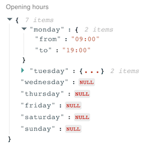
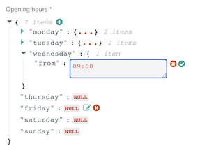

# React Admin JSON view  

JSON field and input for [react-admin](https://github.com/marmelab/react-admin).
Built with [react-json-view](https://github.com/mac-s-g/react-json-view).

Field:



Input:



## Installation

```sh
npm install react-admin-json-view
```

## Usage

```jsx
import { JsonField, JsonInput } from "react-admin-json-view";

// ...

export const ExampleShow = (props) => (
  <Show {...props}>
    <SimpleShowLayout>
      <JsonField
        source="example"
        addLabel={true}
        reactJsonOptions={{
          // Props passed to react-json-view
          name: null,
          collapsed: true,
          enableClipboard: false,
          displayDataTypes: false,
        }}
      />
    </SimpleShowLayout>
  </Show>
);

export const ExampleEdit = (props) => (
  <Edit {...props}>
    <SimpleForm>
      <JsonInput
        source="example"
        validate={[required()]}
        reactJsonOptions={{
          // Props passed to react-json-view
          name: null,
          collapsed: true,
          enableClipboard: false,
          displayDataTypes: false,
        }}
      />
    </SimpleForm>
  </Edit>
);
```
